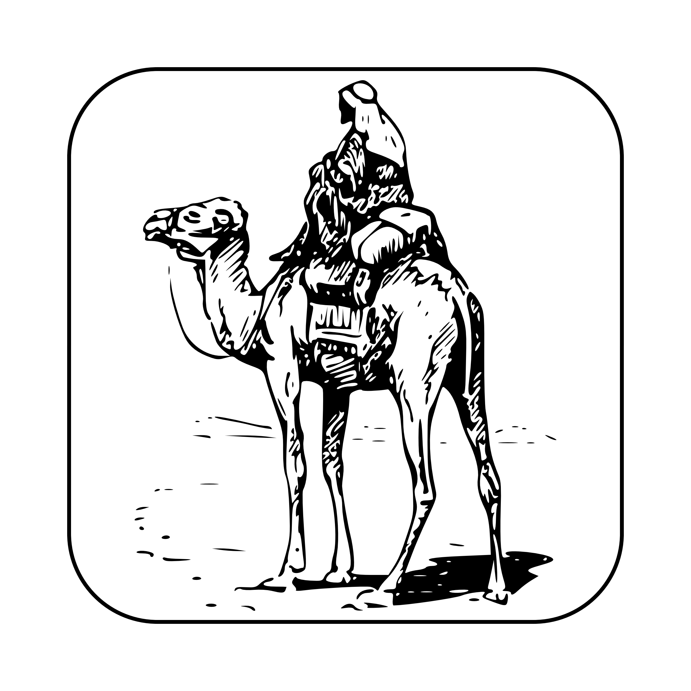

<h1 align="left">
  Caravan
  
</h1>

### Stream Processing and State Management for Go

[](https://goreportcard.com/report/github.com/kode4food/caravan) [](https://app.travis-ci.com/kode4food/caravan?cache=1) [](https://codeclimate.com/github/kode4food/caravan/test_coverage) [](https://codeclimate.com/github/kode4food/caravan/maintainability) [](https://github.com/kode4food/caravan/blob/main/LICENSE.md)

Caravan is a Go library that provides powerful primitives for building stream processing applications with integrated state management. It combines reactive stream processing with efficient table operations to enable real-time data transformations, aggregations, and stateful workflows.

_This is a work in progress. The basics are there, but not yet ready for production use. Use at your own risk_

## Features

- **Topics** - FIFO message logs with independent producer/consumer tracking
- **Streams** - Composable stream processing pipelines with rich operators
- **Tables** - In-memory key-value tables with column-based storage
- **Type Safety** - Fully generic APIs leveraging Go 1.25+ generics
- **Backpressure** - Natural flow control through channel semantics
- **Batch Operations** - Efficient batch updates for high-throughput scenarios
- **Aggregations** - Stateful stream aggregations with table integration
- **Flexible Retention** - Configurable retention policies (timed, counted, consumed)

## Installation

```bash
go get github.com/kode4food/caravan
```

Requires Go 1.25 or later.

## Quick Start

### Topics

Topics provide durable, FIFO message logs with independent consumer tracking:

```go
import "github.com/kode4food/caravan"

// Create a topic
topic := caravan.NewTopic[string]()

// Produce messages
producer := topic.NewProducer()
defer producer.Close()
producer.Send() <- "hello world"

// Consume messages
consumer := topic.NewConsumer()
defer consumer.Close()
msg := <-consumer.Receive()
```

### Streams

Build composable stream processing pipelines:

```go
import (
    "github.com/kode4food/caravan"
    "github.com/kode4food/caravan/stream/node"
)

type Order struct {
    ID     string
    Amount int
}

// Create input/output topics
ordersIn := caravan.NewTopic[*Order]()
totalsOut := caravan.NewTopic[int]()

// Build a stream pipeline
stream := caravan.NewStream(
    node.Bind(
        node.Bind(
            node.TopicConsumer(ordersIn),
            node.Filter(func(o *Order) bool {
                return o.Amount > 100
            }),
        ),
        node.Map(func(o *Order) int {
            return o.Amount
        }),
    ),
    node.TopicProducer(totalsOut),
)

// Start processing
running := stream.Start()
defer running.Stop()
```

### Tables

Efficient key-value storage with column-based operations:

```go
import (
    "github.com/kode4food/caravan"
    "github.com/kode4food/caravan/table/column"
)

type User struct {
    ID    string
    Name  string
    Email string
}

// Create a table
usersTable, _ := caravan.NewTable[string, string](
    "id", "name", "email",
)

// Create an updater
updater, _ := caravan.NewTableUpdater(
    usersTable,
    func(u *User) string { return u.ID },
    column.Make("id", func(u *User) string { return u.ID }),
    column.Make("name", func(u *User) string { return u.Name }),
    column.Make("email", func(u *User) string { return u.Email }),
)

// Update the table from a stream
usersIn := caravan.NewTopic[*User]()
usersOut := caravan.NewTopic[*User]()

stream := caravan.NewStream(
    node.Bind(
        node.TopicConsumer(usersIn),
        node.TableUpdater(updater),
    ),
    node.TopicProducer(usersOut),
)

running := stream.Start()
defer running.Stop()

// Produce users
producer := usersIn.NewProducer()
defer producer.Close()
producer.Send() <- &User{ID: "1", Name: "Alice", Email: "alice@example.com"}

// Consume to allow processing
consumer := usersOut.NewConsumer()
defer consumer.Close()
<-consumer.Receive()

// Query the table
getter, _ := usersTable.Getter("name", "email")
values, _ := getter("1")
fmt.Printf("User: %s <%s>\n", values[0], values[1])
```

## Stream Operators

Caravan provides a rich set of stream operators for building complex pipelines:

### Transformation
- `Map` - Transform messages one-to-one
- `FlatMap` - Transform messages one-to-many
- `Filter` - Filter messages by predicate
- `Transform` - Generic transformation operator

### Aggregation
- `Scan` - Stateful accumulation
- `Aggregate` - Windowed aggregations
- `TableAggregate` - Aggregate to table storage
- `Reduce` - Reduce to single value

### Grouping & Windowing
- `GroupBy` - Partition by key
- `Window` - Time-based windowing
- `Buffer` - Batch messages by count or time

### Table Integration
- `TableUpdate` - Update table from stream
- `TableBatchUpdate` - Batch update table
- `TableScan` - Multi-key table lookups
- `TableAggregate` - Aggregate into table

### Flow Control
- `Limit` - Limit message count
- `DistinctBy` - Remove duplicates
- `Retry` - Retry failed operations
- `Debounce` - Rate limiting
- `Throttle` - Throttle message rate

### Utilities
- `ForEach` - Side effects
- `Split` - Split stream by predicate
- `Combine` - Merge multiple streams
- `Generate` - Generate messages

## Advanced Examples

### Real-time Aggregation with Tables

```go
// Aggregate order totals by user in real-time
statsTable, _ := caravan.NewTable[string, string](
    "user_id", "order_count", "total_amount",
)
setter, _ := statsTable.Setter("user_id", "order_count", "total_amount")

ordersIn := caravan.NewTopic[*Order]()
statsOut := caravan.NewTopic[*UserStats]()

stream := caravan.NewStream(
    node.Bind(
        node.Bind(
            node.TopicConsumer(ordersIn),
            node.GroupBy(func(o *Order) string {
                return o.UserID
            }),
        ),
        node.TableAggregate(
            &UserStats{OrderCount: 0, TotalAmount: 0},
            func(stats *UserStats, order *Order) *UserStats {
                return &UserStats{
                    UserID:      order.UserID,
                    OrderCount:  stats.OrderCount + 1,
                    TotalAmount: stats.TotalAmount + order.Amount,
                }
            },
            func(stats *UserStats) (string, []string) {
                return stats.UserID, []string{
                    stats.UserID,
                    fmt.Sprintf("%d", stats.OrderCount),
                    fmt.Sprintf("%d", stats.TotalAmount),
                }
            },
            setter,
        ),
    ),
    node.TopicProducer(statsOut),
)
```

### Batch Processing for High Throughput

```go
// Buffer messages and update table in batches
ordersIn := caravan.NewTopic[*Order]()
batchesOut := caravan.NewTopic[[]*Order]()

stream := caravan.NewStream(
    node.Bind(
        node.Bind(
            node.TopicConsumer(ordersIn),
            node.Buffer[*Order](100, 1*time.Second), // 100 messages or 1 second
        ),
        node.TableBatchUpdate(orderUpdater),
    ),
    node.TopicProducer(batchesOut),
)
```

### Complex Multi-stage Pipeline

```go
// Deduplicate -> Batch -> Update -> Aggregate
stream := caravan.NewStream(
    node.Bind(
        node.Bind(
            node.Bind(
                node.Bind(
                    node.TopicConsumer(ordersIn),
                    node.DistinctBy(func(o *Order) string {
                        return o.ID
                    }),
                ),
                node.Buffer[*Order](10, 500*time.Millisecond),
            ),
            node.TableBatchUpdate(orderUpdater),
        ),
        node.FlatMap(func(batch []*Order) []*Order {
            return batch
        }),
    ),
    node.Scan(
        func(totals map[string]int, o *Order) map[string]int {
            totals[o.UserID] += o.Amount
            return totals
        },
    ),
    node.TopicProducer(statsOut),
)
```

## Topic Retention Policies

Configure how long messages are retained in topics:

```go
import (
    "github.com/kode4food/caravan"
    "github.com/kode4food/caravan/topic/config"
    "github.com/kode4food/caravan/topic/retention"
)

// Time-based retention (keep 1 hour)
topic := caravan.NewTopic[string](
    config.WithRetention(retention.Timed(1 * time.Hour)),
)

// Count-based retention (keep 1000 messages)
topic := caravan.NewTopic[string](
    config.WithRetention(retention.Counted(1000)),
)

// Consumed-based retention (keep until all consumers read)
topic := caravan.NewTopic[string](
    config.WithRetention(retention.Consumed()),
)

// Composed retention (keep 1000 messages OR 1 hour)
topic := caravan.NewTopic[string](
    config.WithRetention(
        retention.Compose(
            retention.Counted(1000),
            retention.Timed(1 * time.Hour),
        ),
    ),
)
```

## Error Handling

Streams provide flexible error handling through the advice system:

```go
stream := caravan.NewStream(/* ... */)

running := stream.StartWith(func(advice context.Advice, next func()) {
    switch advice.Type() {
    case context.ErrorAdvice:
        log.Printf("Recoverable error: %v", advice.Error())
        next() // Continue processing
    case context.FatalAdvice:
        log.Printf("Fatal error: %v", advice.Error())
        // Don't call next() to stop processing
    default:
        next()
    }
})
```

## Examples

See the [examples](./examples) directory for complete working examples:

- [table_operations.go](./examples/table_operations.go) - Comprehensive table and stream integration examples

## Documentation

For detailed API documentation, see the [Go package documentation](https://pkg.go.dev/github.com/kode4food/caravan).

## License

Caravan is released under the [MIT License](./LICENSE.md).

Copyright (c) 2021-2025 Thomas S. Bradford
